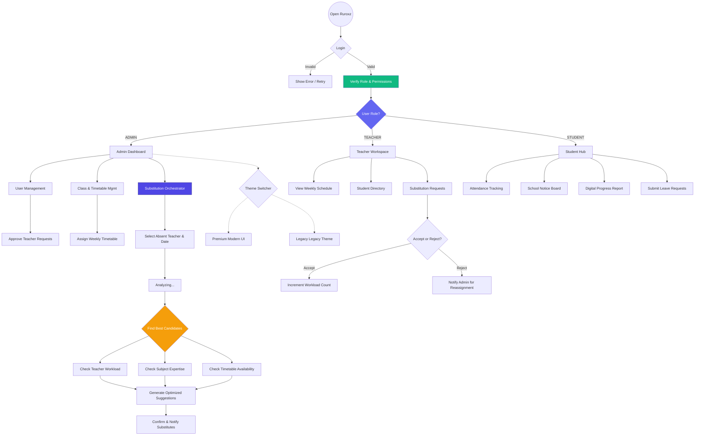

# Ruroxz School ERP - System Flow Documentation

This document outlines the primary user flows and system architecture for the Ruroxz platform.

## System Architecture Overview

## Core Modules

### 1. Authentication & Security
- **JWT Implementation**: Secure token-based authentication handled via `AuthGuard`.
- **Role-Based Access Control (RBAC)**: Enforced in both frontend (Layout shells) and backend (RolesGuard).
- **Approval Workflow**: New teachers must be approved by an Admin before they can access the dashboard.

### 2. Substitution Orchestrator
The `SubstitutionsService` is the heart of the automation logic. It solves the "Absence Gap" problem by:
- **Filtering**: Removing the absent teacher and anyone already scheduled for a class.
- **Ranking**: Sorting candidates by `workload` (ascending) and `subjectMatch` (descending).
- **Cascading**: Handling cases where a single teacher absence affects multiple periods throughout the day.

### 3. Relational Data Model (Prisma)
- **SchoolClass Node**: Acts as the bridge between Teachers (Timetable) and Students (Roster).
- **Cascading Deletes**: Ensures that when a substitution is cancelled, workload counts are correctly decremented.

### 4. Responsive Design System
- **Mobile-First Layouts**: Sidebar drawers and card-based data views.
- **Tabbed Timetables**: A specialized mobile view for complex schedules.
- **Theme Engine**: Support for Modern (Indigo) and Legacy (Green) aesthetics via CSS variables.

---
*Last Updated: April 2026*
